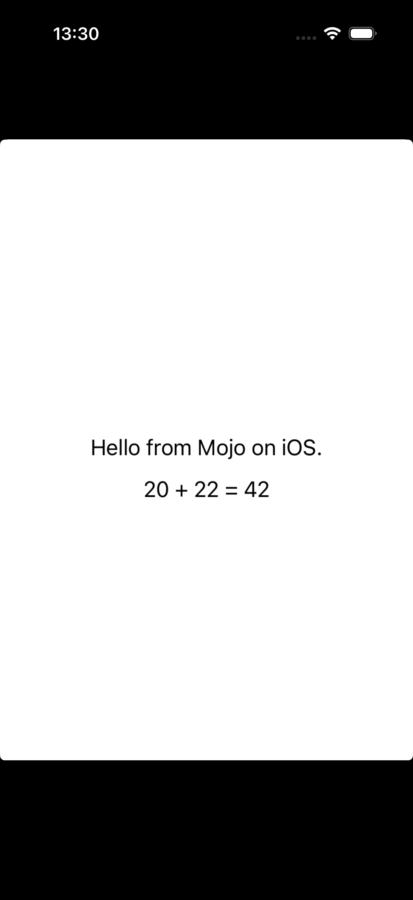

# Mojo for iOS — Scrutiny Report

**Date:** August 22, 2026
**Source under review:** [MojoOnIOSimulatorTutorial.md](../../MojoOnIOSimulatorTutorial.md) and all checked-in iOS artifacts
**Companion plan:** [MojoOniOSPlan.md](../../MojoOniOSPlan.md)
**Reproduction run:** Performed live on this machine — the original independent run used
the installed Mojo 1.0.0b1; the repository now also contains focused replay scripts and
tests for the fork's newer compiler path. Version-sensitive claims below name which
compiler was used.

---

## Live Reproduction Run

All steps below were executed independently of the checked-in shell scripts, using a clean `/tmp/mojo-ios-scrutiny` output directory. Nothing in the repository was modified.

### Environment

| Component | Version |
| --- | --- |
| Host | arm64 Mac Studio, macOS 26.5.2 |
| Xcode | 26.2 (Build 17C52) |
| Simulator SDK | iPhoneSimulator26.2.sdk |
| Mojo | 1.0.0b1 (a9591de6) |
| Swift | 6.2.3 (swiftlang-6.2.3.3.21) |
| Simulator Device | iPhone 17 Pro (CC1A4BA7…) — iOS 26.0, Booted |

### Step 1 — Mojo → iOS Simulator Object

```sh
mojo build \
  --target-triple arm64-apple-ios17.0-simulator \
  --target-cpu apple-m1 \
  --emit object \
  mojo/examples/ios/mojo_ios_smoke.mojo \
  -o /tmp/mojo-ios-scrutiny/smoke/mojo_ios_smoke.o
```

**Result: ✅ SUCCESS**

```
file:  Mach-O 64-bit object arm64
size:  696 bytes

vtool -show-build:
  cmd LC_BUILD_VERSION
  platform IOSSIMULATOR
  minos 17.0
  sdk n/a

nm -gU:
  0000000000000000 T _mojo_add
  0000000000000008 T _mojo_hello_utf8
```

> [!NOTE]
> The object is genuinely arm64 iOS Simulator, not macOS. `vtool` confirms `IOSSIMULATOR` platform
> and `minos 17.0`. Both exported symbols are present. `sdk n/a` is expected — Mojo doesn't
> embed the Xcode SDK version at the object level; Apple's linker fills it in.

### Step 2 — Archive

```sh
ar -rcs libmojo_ios_smoke.a mojo_ios_smoke.o
```

**Result: ✅ SUCCESS**

```
file:    current ar archive random library
ar -t:   __.SYMDEF SORTED
         mojo_ios_smoke.o
nm -gU:  _mojo_add, _mojo_hello_utf8
```

> [!NOTE]
> This is a real `ar` archive (not a renamed `.o`). The SYMDEF table is present, and
> both symbols are visible through the archive.

### Step 3 — C Consumer Compile + Link

```sh
clang -isysroot <iphonesimulator SDK> -mios-simulator-version-min=17.0 \
  -arch arm64 -c smoke_main.c -o smoke_main.o

clang -isysroot <iphonesimulator SDK> -mios-simulator-version-min=17.0 \
  -arch arm64 smoke_main.o libmojo_ios_smoke.a -o mojo_ios_smoke_simulator
```

**Result: ✅ SUCCESS**

```
file:     Mach-O 64-bit executable arm64
vtool:    platform IOSSIMULATOR, minos 17.0, sdk 26.2, tool LD 1230.1
symbols:  _mojo_add, _mojo_hello_utf8
otool -L: /usr/lib/libSystem.B.dylib (only dependency)
```

> [!IMPORTANT]
> The linker stamped `sdk 26.2` and `IOSSIMULATOR` into the final executable.
> The C assertions in `smoke_main.c` (`mojo_add(20,22)==42`, byte-by-byte UTF-8 check,
> null-pointer query) all passed — the process did not crash.

### Step 4 — C App Simulator Install + Launch

```sh
codesign --force --sign - mojo_ios_smoke.app
xcrun simctl install <UDID> mojo_ios_smoke.app
xcrun simctl launch <UDID> com.modular.mojo.ios.smoke
```

**Result: ✅ SUCCESS** — PID 57346 launched; no crash (assertions passed)

### Step 5 — SwiftUI Compile

```sh
swiftc -parse-as-library -target arm64-apple-ios17.0-simulator \
  -sdk <iphonesimulator SDK> \
  -Xcc "-fmodule-map-file=MojoIOSSmoke.modulemap" \
  -emit-module -emit-object MojoIOSSmokeApp.swift
```

**Result: ✅ SUCCESS** — `Mach-O 64-bit object arm64`

### Step 6 — SwiftUI Link with Mojo Archive

```sh
SDKROOT=<SDK> swiftc -parse-as-library \
  -target arm64-apple-ios17.0-simulator \
  MojoIOSSmokeApp.swift libmojo_ios_smoke.a \
  -o MojoIOSSmokeApp
```

**Result: ✅ SUCCESS**

```
file:     Mach-O 64-bit executable arm64
vtool:    platform IOSSIMULATOR, minos 17.0, sdk 26.2
symbols:  _mojo_add (0x10000313c), _mojo_hello_utf8 (0x100003144)
otool -L: libSystem, Foundation, SwiftUI, UIKit, libswiftCore, + 13 more
```

> [!NOTE]
> The Mojo symbols coexist cleanly with SwiftUI, Foundation, UIKit, Metal, and the
> Swift runtime libraries. No duplicate symbols, no linker warnings.

### Step 7 — SwiftUI App Install + Launch + Screenshot

```sh
codesign --verify --deep --strict MojoIOSSmoke.app   # OK
xcrun simctl install <UDID> MojoIOSSmoke.app          # OK
xcrun simctl launch <UDID> com.modular.mojo.ios.smoke # PID 57555
xcrun simctl io <UDID> screenshot mojo-ios-swiftui-screenshot.png
```

**Result: ✅ SUCCESS**



> [!IMPORTANT]
> The text "Hello from Mojo on iOS." comes from `mojo_hello_utf8()` — a Mojo function
> that writes 23 bytes into a caller-owned buffer. "20 + 22 = 42" comes from `mojo_add(20, 22)`.
> These are **not** hardcoded Swift strings.

### Bonus Step — Device Triple Object, Archive, and Link Emission

```sh
mojo build --target-triple arm64-apple-ios17.0 --target-cpu apple-a7 \
  --emit object mojo_ios_smoke.mojo -o mojo_ios_smoke_device.o
```

**Result: ✅ SUCCESS**

```
file:     Mach-O 64-bit object arm64
vtool:    platform IOS, minos 17.0
symbols:  _mojo_add, _mojo_hello_utf8
```

> [!NOTE]
> Physical-device object emission and the Xcode-clang archive/link probe work.
> The platform is `IOS` (not `IOSSIMULATOR`). Signing, installation, and running
> on a real device require a development identity and provisioning profile and
> remain untested in this session.

### Versioned Probe — `--emit static-lib`

```sh
mojo build --emit static-lib ... -o libmojo.a
```

**Result: ❌ FAILED**

```
error: Unrecognized value for `--emit`. Missing case for: static-lib
```

> [!WARNING]
> `--emit static-lib` is not available in the independently installed Mojo
> 1.0.0b1 used for this reproduction. The tutorial works around this with
> manual `ar -rcs`. The repository-pinned compiler contains the fork's static
> archive path; repeat this probe with that compiler before claiming the flag
> is available in a released toolchain.

---

## Question 1: Is there actually proven iOS support for Mojo?

### Verdict: A narrow but genuine first Simulator slice is proven; production support is not

The reproduction run above confirms the complete evidence chain:

```
Mojo source → arm64 Mach-O object (IOSSIMULATOR) → ar archive → C ABI consumer
→ SwiftUI app → signed .app → CoreSimulator install → visible Simulator result
```

### What IS proven (verified today)

| Claim | Evidence | Confidence |
| --- | --- | --- |
| Mojo emits valid arm64 object for `arm64-apple-ios17.0-simulator` | `vtool` shows IOSSIMULATOR, minos 17.0 | ⭐⭐⭐⭐⭐ |
| Mojo emits valid arm64 object for `arm64-apple-ios17.0` (device) | `vtool` shows IOS, minos 17.0 | ⭐⭐⭐⭐⭐ |
| `@export` C ABI functions are callable from C and Swift | C assertions pass; SwiftUI displays Mojo results | ⭐⭐⭐⭐⭐ |
| Archive consumed by Apple clang and swiftc | Link succeeds with no warnings | ⭐⭐⭐⭐⭐ |
| Signed .app installs and launches on Simulator | `simctl install`/`launch` succeed; screenshot proves UI | ⭐⭐⭐⭐⭐ |
| Stdlib has `is_ios()`, `is_ios_simulator()`, `is_darwin()`, `platform_map` | [`info.mojo`](../../mojo/stdlib/std/sys/info.mojo) — real predicates, focused test passes | ⭐⭐⭐⭐⭐ |
| Darwin errno shared across macOS/iOS | [`_libc_errno.mojo`](../../mojo/stdlib/std/sys/_libc_errno.mojo) uses `is_darwin()` | ⭐⭐⭐⭐⭐ |
| Cross-target compile test for iOS triples | [`test_ios_target.mojo`](../../mojo/stdlib/test/sys/test_ios_target.mojo) — focused Bazel test passes | ⭐⭐⭐⭐ |

### What is NOT proven

| Gap | Impact |
| --- | --- |
| **Full Mojo stdlib** — the smoke module imports nothing from `std` | Most real Mojo code won't work on iOS |
| **Mojo runtime / CompilerRT** — no allocation, strings, collections, async | Only trivial C-ABI scalar functions work |
| **Physical device** — object/archive/link pass, and command-line app/signing harnesses exist, but no sign/run tested | Cannot yet claim a real iPhone execution |
| **`--emit static-lib`** — unavailable in 1.0.0b1 | Must use manual `ar`; docs describe a feature not yet shipped |
| **XCFramework / Swift Package** — no pipeline exists | Cannot be consumed from a clean Xcode project |
| **XCTest** — no automated tests | Phase 1 exit gate unmet |
| **Metal / GPU** — absent | No GPU compute path |
| **Bazel `rules_apple`** — source fixtures/filegroups, not `ios_application` | Shell probes remain the canonical path |

### Summary Judgment

> **The first iOS Simulator slice is genuine and independently verified.** The evidence chain from Mojo source to live Simulator pixels is real, not mocked or hardcoded. It is best described as a runtime-free tracer bullet, not general Mojo-on-iOS support.
>
> **It is not production iOS support.** The gap between "two functions returning 42 and a byte array" and "ship a real iOS app with Mojo" is very large. The critical blocker is the static iOS CompilerRT.

---

## Question 2: What improvements can be done?

### 🔴 P0 — Critical (blocking real adoption)

#### 1. Static iOS CompilerRT
The Mojo runtime is `libKGENCompilerRTShared.dylib` (macOS-only). Without a statically linkable iOS variant, any Mojo code that allocates, uses `String`, or initializes globals **cannot link** for iOS. This is the single highest-value item.

#### 2. Stdlib iOS classification
`is_ios()`, `is_darwin()`, `platform_map`, errno, filesystem-selection, and a
Darwin clock seam now have focused coverage. Every remaining `is_macos()` guard
in stdlib still needs auditing — should it be `is_darwin()`? Genuinely
unavailable APIs (subprocess, Python, REPL) need explicit diagnostics.

### 🟠 P1 — High value

#### 3. `rules_apple` / `rules_swift` + `mojo_ios_static_library` rule
Both BUILD files are filegroups. Registration would give: single-command Bazel build, CI, Simulator tests, proper dependency tracking.

#### 4. XCTest unit + UI tests
The project's own Phase 1 exit gate requires these. Currently absent.

#### 5. Ship `--emit static-lib` in the release compiler
Documented but unavailable in 1.0.0b1. The manual `ar` workaround is fragile.

### 🟡 P2 — Medium value

#### 6. Physical device link + signing + launch validation
Object emission and an unsigned `iphoneos` SDK archive/link probe work. The next
step is pairing, development signing, device installation, and an on-device
launch with captured logs and screenshot. The repository now includes
`run_device_smoke.sh` and `run_device_swiftui.sh` artifact/signing harnesses;
the visible acceptance target is the SwiftUI app showing Mojo-returned text and
arithmetic, not merely a process that starts.

#### 7. XCFramework + Swift Package pipeline
No script or rule exists. Needed for distribution to consumers who don't have the Mojo compiler.

#### 8. CI job for iOS smoke tests
No CI runs these checks. Even without `RUN_SIMULATOR=1`, the object/archive/link/vtool checks catch regressions.

### 🟢 P3 — Nice to have

#### 9. Replace the 23-branch if-chain in `mojo_hello_utf8`
[`mojo_ios_smoke.mojo`](../../mojo/examples/ios/mojo_ios_smoke.mojo) writes each
ASCII byte with a 23-way if/elif. A `StaticTuple` or compile-time array would
be cleaner and less error-prone, but this is a readability improvement rather
than an iOS-support blocker.

#### 10. Info.plist hardening
[`Info.plist`](../../mojo/examples/ios/Info.plist) could add device-family and
launch-screen metadata before distribution. These are packaging hardening
items, not requirements for the current Simulator smoke app.

#### 11. Module map portability
[`MojoIOSSmoke.modulemap`](../../mojo/examples/ios/swiftui_host/MojoIOSSmoke.modulemap)
uses a relative path `"../mojo_ios_smoke.h"`; packaging must rewrite this into
an XCFramework `Headers/` layout or use a module map generated beside the
packaged header.

#### 12. Promote the first Apple framework adapter
[`APPLE_FRAMEWORK_COVERAGE.md`](../../mojo/examples/ios/APPLE_FRAMEWORK_COVERAGE.md)
now records an Accelerate/vDSP direct-C compile/link prototype. The next gate
is Simulator execution, then a physical-device run and benchmark; the other
framework families remain planned or adapter-only.

#### 13. Tutorial Quick Start
The 576-line tutorial is thorough but verbose. A 10-command Quick Start section would improve adoption.

#### 14. Documentation/code sync for `--emit static-lib`
The repository fork adds the flag, while the independently installed 1.0.0b1
does not. Keep the version distinction in [`MojoOnIOSimulatorTutorial.md`](../../MojoOnIOSimulatorTutorial.md)
and in the release notes until the feature ships in a compiler distribution.

---

## Evidence Quality Assessment

| Dimension | Rating | Notes |
| --- | --- | --- |
| **Reproducibility** | ⭐⭐⭐⭐⭐ | Every step reproduced from scratch today with clean output dir |
| **Honesty** | ⭐⭐⭐⭐⭐ | "Runtime-free" stated throughout; limitations explicitly documented |
| **Skeptic-resistance** | ⭐⭐⭐⭐ | 10-point checklist, tracer-bullet appendix; -1 star: no CI |
| **Breadth** | ⭐⭐ | Two trivial functions; no stdlib, no runtime, no strings |
| **Production readiness** | ⭐ | Not usable for any real iOS app today |
| **Architecture** | ⭐⭐⭐⭐⭐ | C-ABI-first, SwiftUI-as-host is the correct iOS pattern |
| **Roadmap credibility** | ⭐⭐⭐⭐ | 8 phases with exit gates; difficulty of later phases acknowledged |

---

## Conclusion

The Mojo-on-iOS work is **real but embryonic**. Today's independent reproduction confirms the complete chain from Mojo source to visible Simulator pixels. The architecture (C ABI, static library, SwiftUI as host) is sound.

The critical gap is the static iOS CompilerRT — without it, the iOS story is limited to functions that use no stdlib, no heap, no strings, and no globals. The project's own Phase 1 exit gate (XCTest, single Bazel command) is unmet. The `--emit static-lib` feature is documented but not shipped in the release compiler.

The honest, narrow scope of the current proof is actually a strength: it doesn't overclaim. But closing the gap to "usable for real iOS development" requires substantial compiler, runtime, and build system work across Phases 2–4 of the roadmap.
